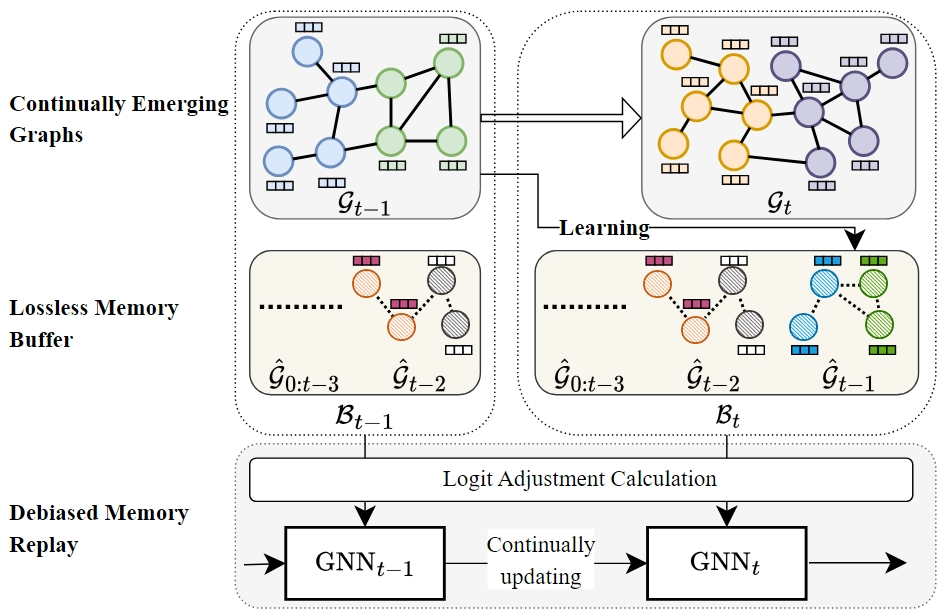

# DeLoMe
Code for Graph Continual Learning with Debiased Lossless Memory Replay ([DeLoMe](https://arxiv.org/pdf/2404.10984) and [Supplementary](Supp.pdf)) (ECAI 2024)

## Abstract

Real-life graph data often expands continually, rendering the learning of graph neural networks (GNNs) on static graph data impractical. Graph continual learning (GCL) tackles this problem by continually adapting GNNs to the expanded graph of the current task while maintaining the performance over the graph of previous tasks. Memory replay-based methods, which aim to replay data of previous tasks when learning new tasks, have been explored as one principled approach to mitigate the forgetting of the knowledge learned from the previous tasks. In this paper we extend this methodology with a novel framework, called Debiased Lossless Memory replay (DeLoMe). Unlike existing methods that \textit{sample nodes/edges of previous graphs} to construct the memory, DeLoMe \textit{learns lossless prototypical node representations} as the memory. The learned memory can not only preserve the graph data privacy but also capture the holistic graph information, both of which the sampling-based methods fail to achieve. Further, prior methods suffer from bias toward the current task due to the data imbalance between the classes in the memory data and the current data. A debiased GCL loss function is devised in DeLoMe to effectively alleviate this bias. Extensive experiments on four graph datasets show the effectiveness of DeLoMe under both class- and task-incremental learning settings.

## Train
Replace the dataset in the following command with the corresponding dataset like CoraFull-CL.

     python train.py --dataset dataset --method DeLoMe --backbone SGC

## Acknowledgment
This code is implemented based on [CGLB](https://github.com/QueuQ/CGLB/tree/master) Please refer to CGLB for more baselines and implementation details.
